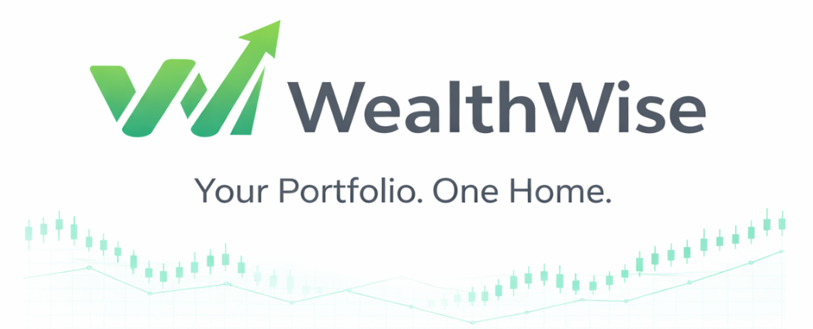
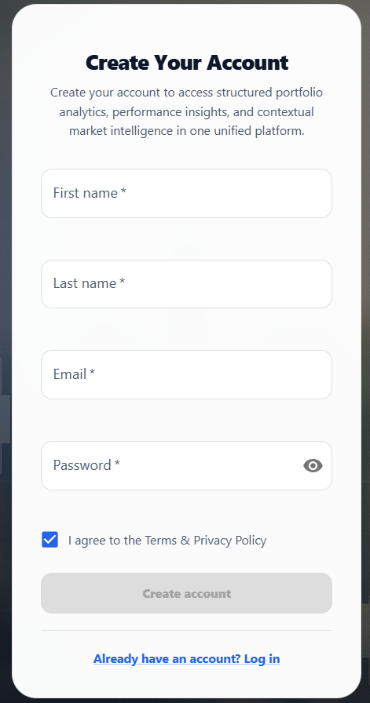
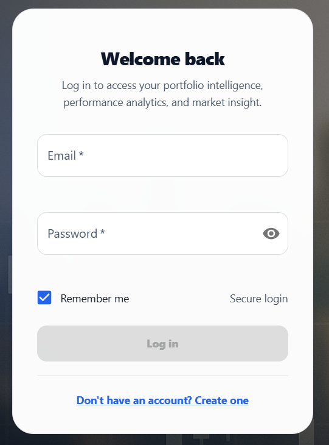
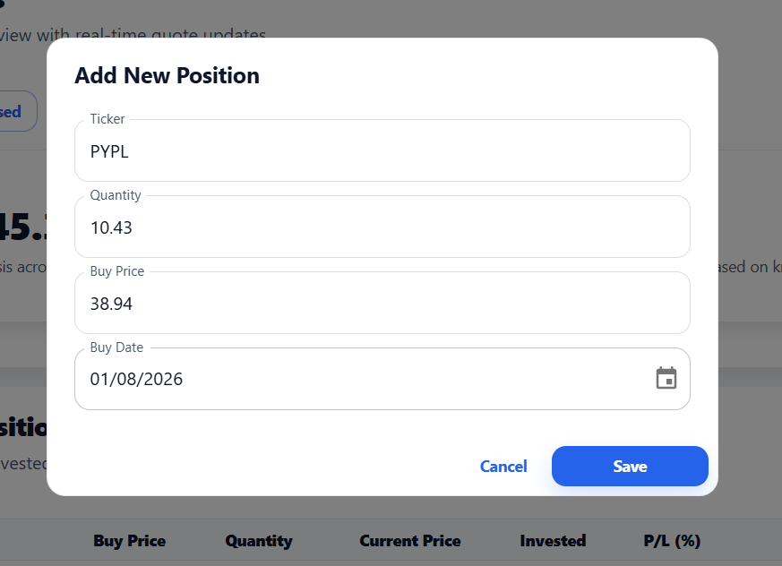
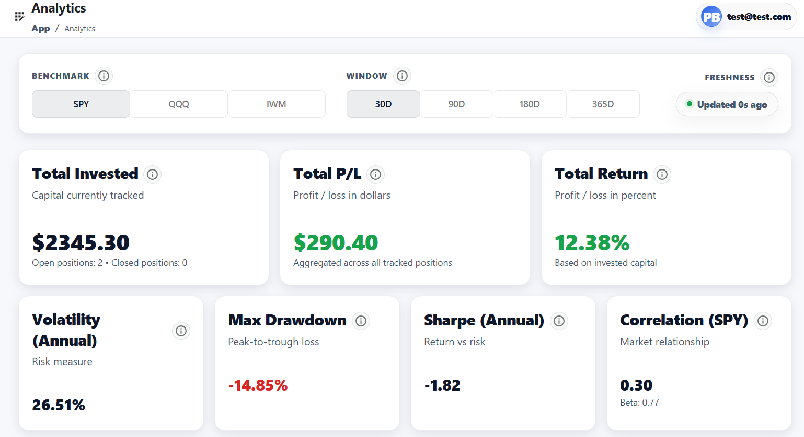
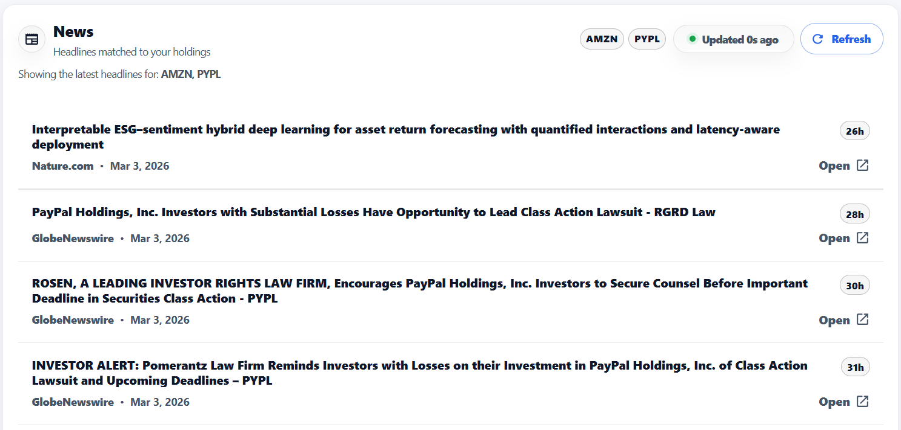

<p align="center">
  
</p>

<p align="center">


</p>

WealthWise is a microservice-based portfolio tracking platform designed to help investors monitor their holdings, analyze performance, and stay informed with relevant financial news in one unified application.

Many investors rely on multiple tools to manage their portfolios, often switching between different dashboards, analytics platforms, and news sources. This can lead to fragmented insights and the inconvenience of managing multiple accounts and credentials. WealthWise addresses this problem by providing a single platform where users can track their positions, view portfolio analytics, and access curated market news related to their holdings.

The platform is built using a microservice architecture with a React frontend and multiple FastAPI backend services responsible for positions management, market data retrieval, analytics computation, and financial news aggregation. Real-time updates are delivered through WebSockets, allowing portfolio changes and pricing information to appear instantly without requiring manual refreshes.

By separating responsibilities into dedicated services, WealthWise remains modular, scalable, and easier to maintain while delivering a responsive and intuitive user experience.

---

## Table of Contents

- [Architecture Overview](#architecture-overview)
- [Tech Stack](#tech-stack)
- [Key Features](#key-features)
- [Project Structure](#project-structure)
- [Installation and Setup](#installation-and-setup)
- [Using the Application](#using-the-application)
- [Running Tests](#running-tests)
- [Future Improvements](#future-improvements)
- [Contributing](#contributing)
- [Credits](#credits)
- [License](#license)

---

## Architecture Overview

WealthWise is built using a **microservice architecture** designed to keep the system modular, scalable, and maintainable. Instead of placing all functionality in a single backend application, responsibilities are separated into specialized services that communicate through HTTP APIs and real-time events.

This design makes the system easier to evolve over time, allows individual services to scale independently, and keeps each service focused on a clearly defined domain.

### System Overview

The platform consists of:

- **React & TypeScript Frontend**
- **Multiple FastAPI Backend Services**
- **PostgreSQL Database**
- **WebSocket-Based Real-Time Updates (Socket.IO)**
- **Docker Compose Orchestration**

### Backend Services

The backend of WealthWise is organized into a set of dedicated microservices, each responsible for a specific domain within the platform. Together, these services power the core functionality of the application while keeping the system modular and scalable.

#### 🧩 Positions Service

The **Positions Service** is the central service of the WealthWise platform and is responsible for managing the user's portfolio data and account lifecycle. It handles authentication, position management, quote snapshot caching, and real-time portfolio updates.

This service acts as the primary interface between the frontend application and the user's stored investment data.

Responsibilities:

- **User authentication and account management**  
  Handles user registration, login, account updates, and secure password storage using hashed credentials and JWT-based authentication.

- **Portfolio position management**  
  Allows users to create, update, close, and delete investment positions while maintaining accurate historical records of buy and sell transactions.

- **Persistent portfolio storage**  
  Stores user accounts, positions, and quote snapshots in a PostgreSQL database using an asynchronous SQLAlchemy data layer.

- **Quote snapshot caching**  
  Maintains cached snapshots of the latest market prices for tracked symbols to reduce unnecessary external API calls and improve response times.

- **Real-time portfolio updates**  
  Uses WebSockets via Socket.IO to broadcast portfolio changes and price updates to connected clients instantly.

- **Event-driven client synchronization**  
  When a user connects, the service retrieves their tracked tickers, loads cached quote snapshots, refreshes stale quotes when necessary, and sends an initial price snapshot to the client.

In addition to handling API requests, the Positions Service runs a **background price polling system** that periodically refreshes market prices for tracked symbols. When new price data is detected, updates are broadcast to all connected clients in real time, ensuring that portfolio values and analytics remain up to date without requiring manual page refreshes.

#### 📈 Market Data Service

The **Market Data Service** is responsible for retrieving and standardizing financial market data used throughout the WealthWise platform. It acts as a dedicated gateway between the internal system and external financial data providers.

By isolating all external data integrations within a single service, WealthWise ensures that the rest of the platform can access reliable market data without needing to manage external API complexity or provider-specific logic.

Responsibilities:

- **External market data retrieval**  
  Fetches real-time and recent pricing information for stocks and cryptocurrencies from third-party financial data providers.

- **Integration with financial data APIs**  
  Communicates with external market data providers and handles provider-specific request formats, response structures, rate limits, and error handling.

- **Data normalization and validation**  
  Transforms raw API responses into a consistent internal format so that all backend services receive standardized quote data regardless of the original provider.

- **Providing a unified quotes API**  
  Exposes a simple `/quotes` endpoint that other services can call to retrieve price data for one or more symbols.

- **Company logo resolution**  
  Retrieves company logo assets associated with stock symbols so that portfolio positions can display recognizable branding alongside financial data.

- **Reliability and fault tolerance**  
  Implements retry logic and error handling to gracefully manage network failures or temporary outages from external data providers.

Currently, the service retrieves pricing data using **Yahoo Finance via the `yfinance` library**, which provides access to stock market pricing and historical quote information.

For company logos, the service uses **[Logo.dev](https://www.logo.dev/)** to retrieve brand assets based on the company's website domain. The domain is obtained from Yahoo Finance metadata and used to construct a Logo.dev image URL that can be rendered directly by the frontend.

This integration is encapsulated within the Market Data Service so that logo providers can be replaced or extended in the future without requiring changes to other parts of the platform. If a domain-based logo cannot be resolved, the service falls back to the logo URL provided by Yahoo Finance when available.

#### 📊 Analytics Service

The **Analytics Service** is responsible for computing portfolio insights and performance metrics for the WealthWise platform. It processes portfolio data and market prices to generate meaningful analytics that help users understand how their investments are performing over time.

Rather than embedding analytical calculations directly inside transactional services, WealthWise isolates this functionality within a dedicated analytics service. This allows performance calculations to evolve independently while keeping the rest of the system lightweight and responsive.

Responsibilities:

- **Portfolio performance calculations**  
  Computes portfolio-level metrics such as total profit and loss, percentage returns, and overall portfolio value based on the user’s recorded positions and current market prices.

- **Risk and performance metrics**  
  Calculates indicators that help users understand portfolio risk and performance characteristics, such as volatility, drawdowns, and performance trends over time.

- **Portfolio allocation analysis**  
  Breaks down the distribution of investments across different assets and symbols to highlight concentration and diversification.

- **Historical portfolio value tracking**  
  Generates historical performance data that allows users to visualize how their portfolio value has evolved over time.

- **Aggregated analytics endpoints**  
  Exposes structured analytics APIs that the frontend can use to render dashboards, performance summaries, and visualizations.

By isolating portfolio analytics into a dedicated service, WealthWise ensures that computational workloads remain separate from core transactional operations. This design allows the analytics engine to scale independently as more complex metrics and historical calculations are introduced.

#### 📰 News Service

The **News Service** is responsible for aggregating and delivering financial news that is relevant to the user's tracked investments. It provides a centralized way for the WealthWise platform to retrieve, process, and serve market news without exposing the rest of the system to the complexities of external news providers.

By isolating news retrieval and processing into its own service, the platform can integrate with third-party news APIs while keeping the core portfolio and analytics services independent from external content providers.

Responsibilities:

- **Financial news retrieval**  
  Fetches the latest market news articles from external news providers.

- **Integration with external news APIs**  
  Handles provider-specific request formats, response parsing, rate limits, and error handling.

- **Article filtering and normalization**  
  Converts raw news data into a consistent internal format that can be easily consumed by the frontend.

- **Portfolio-relevant news curation**  
  Filters and prioritizes articles based on the symbols tracked in a user's portfolio.

- **News delivery API**  
  Exposes API endpoints that allow the frontend to retrieve curated financial news.

Currently, the service retrieves articles using **[NewsAPI](https://newsapi.org/)**. The integration is intentionally encapsulated within the News Service so that the underlying provider can be replaced or extended in the future without requiring changes to other parts of the platform.

---

## Tech Stack

WealthWise is built using a modern full-stack architecture composed of a React frontend, multiple FastAPI microservices, and a containerized infrastructure. The technology choices prioritize scalability, maintainability, and real-time responsiveness.

### 🎨 Frontend

- **React 18** – Component-based UI framework  
- **TypeScript** – Strong typing for safer and more maintainable code  
- **Vite** – Fast development server and optimized builds  
- **Material UI (MUI)** – Clean, modern component library  
- **React Query (TanStack Query)** – Server-state management and caching  
- **Axios** – HTTP client for backend APIs  
- **Socket.IO Client** – Real-time portfolio and pricing updates  
- **Jest + React Testing Library** – Frontend testing

### ⚙️ Backend

- **Python 3.10+**
- **FastAPI** – High-performance microservice framework
- **SQLAlchemy (Async)** – Async ORM for data access
- **PostgreSQL** – Primary relational database
- **Pydantic** – Validation and configuration
- **Alembic** – Database migrations
- **JWT Authentication** – Stateless user sessions
- **Passlib (Argon2)** – Secure password hashing
- **Socket.IO** – Real-time event delivery
- **AsyncIO** – Background work and service communication

### 🔗 External Integrations

- **Yahoo Finance (`yfinance`)** – Market price data  
- **Logo.dev** – Company logo resolution based on domain metadata  
- **NewsAPI** – Financial news aggregation  

### 🐳 Infrastructure

- **Docker** – Containerization of all services (frontend + backend)
- **Docker Compose** – Local orchestration
- **Environment-based configuration** – `.env` driven config

---

## Key Features

### 📊 Unified Portfolio Tracking
Track open and closed positions in one place with clear totals and performance summaries, without juggling multiple apps or credentials.

### ⚡ Real-Time Price Updates
Socket.IO keeps pricing and portfolio views synchronized in real time. On connect, the system delivers a snapshot and then streams updates as prices change.

### 📈 Portfolio Analytics and Insights
Compute portfolio performance and risk metrics, allocation breakdowns, and historical portfolio value to power dashboards and charts.

### 📰 Curated Financial News
See relevant articles filtered by the symbols you hold, directly inside the platform.

### 🔐 Secure Authentication
JWT-based authentication with Argon2 password hashing and protected endpoints across services.

### 🧩 Microservice-Based Architecture
Clear separation of concerns across services, enabling independent scaling, simpler maintenance, and fault isolation.

---

## Project Structure

The WealthWise repository separates the frontend from backend microservices. Each service is self-contained and follows a consistent internal structure, making the codebase easier to understand and extend.

### Repository Overview

```text
WealthWise/
│
├── frontend/               # React + TypeScript frontend application
│
├── services/               # Backend microservices
│   ├── positions/          # Portfolio + authentication service
│   ├── market-data/        # Market data retrieval service
│   ├── analytics/          # Portfolio analytics service
│   └── news/               # Financial news aggregation service
│
├── docker-compose.yml      # Local development orchestration
├── .env.example            # Example environment configuration
├── package.json            # Root workspace scripts
└── README.md
```

All components of the platform, including the frontend and backend services, are containerized and can be run together locally using Docker Compose, allowing the entire system to operate as a unified development environment.

### 🎨 Frontend Structure

```text
frontend/src/
│
├── app/                    # App-level providers and routing
├── features/               # Domain feature modules (portfolio, analytics, news, auth, etc.)
├── shared/                 # Shared libraries, theme, reusable UI
└── assets/images/          # Static image assets used by the frontend application
```

### ⚙️ Backend Service Structure

```text
services/<service-name>/
│
├── app/
│   ├── api/                # FastAPI routes and schemas
│   ├── core/               # Config, security, logging
│   ├── db/                 # Engine + SQLAlchemy models
│   ├── repositories/       # Data access layer
│   ├── services/           # Business logic
│   └── main.py             # Service entry point
│
├── migrations/             # Alembic migrations (where applicable)
└── tests/                  # Service tests
```

---

## Installation and Setup

WealthWise is designed to run as a fully containerized application. The entire platform, including the frontend and all backend microservices, can be started locally using **Docker Compose**.

### 1. Prerequisites

Before installing the project, ensure the following tools are installed:

- **Git**
- **Docker**
- **Docker Compose**

Verify your installation:

```bash
docker --version
docker compose version
```

### 2. Clone the Repository

```bash
git clone https://github.com/PatrickB1905/WealthWise.git
cd WealthWise
```

### 3. Configure Environment Variables

Create a `.env` file from the template:

```bash
cp .env.example .env
```

Update these values in `.env`:

| Variable | Description |
|--------|-------------|
| `JWT_SECRET` | Secret key used to sign authentication tokens |
| `NEWS_API_KEY` | API key used by the News Service to retrieve articles |
| `LOGO_DEV_TOKEN` | Publishable API token used by the Market Data Service to retrieve company logos from Logo.dev |

Generate a JWT secret:\
https://jwtsecrets.com/#generator

Get a NewsAPI key:\
https://newsapi.org/

Get a Logo.dev API token:\
https://logo.dev/

> Never commit your `.env` file. Use `.env.example` as the template.

### 4. Start the Application

From the project root:

```bash
docker compose up --build
```

This will build images and start:

- PostgreSQL database
- Positions, Market Data, Analytics, and News services
- Frontend application

### 5. Access the Application

Once the services are running, open your web browser and navigate to:

http://localhost:5173

From here you can:

- Register a new user account
- Add portfolio positions
- View portfolio analytics
- Read curated financial news

### Default Service Ports

| Service | Container Name | Port |
|--------|--------|--------|
| PostgreSQL Database | `wealthwise-db` | 5432 |
| Positions Service | `wealthwise-positions` | 4000 |
| Market Data Service | `wealthwise-market-data` | 5000 |
| News Service | `wealthwise-news` | 6500 |
| Analytics Service | `wealthwise-analytics` | 7000 |
| Frontend | `wealthwise-frontend` | 5173 |

### 6. Stopping the Application

Stop all running services:

```bash
docker compose down
```

To remove volumes and reset the environment:

```bash
docker compose down -v
```

---

## Using the Application

Once the platform is running and accessible in your browser, you can begin using WealthWise to manage and analyze your investment portfolio.

### 1. Create an Account



### 2. Log In



### 3. Add Portfolio Positions



### 4. View Portfolio Analytics



### 5. View Curated Financial News



---

## Running Tests

WealthWise includes automated tests across both the frontend application and backend microservices.

### Frontend (Jest & React Testing Library)

Run frontend tests from the repository root:

```bash
yarn test
```

Watch mode:

```bash
yarn workspace frontend test:watch
```

Full verification (recommended before committing):

```bash
yarn verify
```

### Backend (pytest per service)

Run tests for a specific service:

```bash
cd services/positions
pytest
```

Repeat for other services:

```bash
cd services/analytics
pytest

cd services/market-data
pytest

cd services/news
pytest
```

---

## Future Improvements

WealthWise was designed with extensibility in mind. Planned improvements include:

- **Advanced analytics** (Sharpe/Sortino, correlation, benchmark comparisons)
- **Historical price storage** to reduce external dependency and speed up analytics
- **Higher-frequency pricing updates** (streaming/near real-time data sources)
- **Richer portfolio management** (dividends, transactions, multi-currency support)
- **Observability** (centralized logs, metrics, tracing)
- **Production deployment tooling** (CI/CD, cloud deployment, Kubernetes)

---

## Contributing

Contributions are welcome! WealthWise is designed to be modular and developer-friendly.

### 1. Fork and Clone

```bash
git clone https://github.com/PatrickB1905/WealthWise.git
cd WealthWise
git checkout -b feature/your-feature-name
```

### 2. Quality Checks

**Backend (run inside the service directory):**

```bash
python -m ruff check .
python -m black .
python -m mypy app
python -m pytest
```

**Frontend (run from repo root):**

```bash
yarn format
yarn lint
yarn typecheck
yarn test
```

### 3. Submit a Pull Request

- Use clear commit messages
- Include screenshots for UI changes
- Describe what changed and why
- Note any edge cases and how you tested them

---

## Credits

WealthWise was designed and developed by **Patrick Butler**.

This project was built as a portfolio application to demonstrate modern full-stack engineering practices, including microservice architecture, real-time data updates, and scalable frontend design.

Thanks to the tools and services that made this project possible:

- **React** and **TypeScript** (frontend)
- **FastAPI** (backend microservices)
- **PostgreSQL** (data persistence)
- **Docker** and **Docker Compose** (containerized development)
- **NewsAPI** (financial news aggregation)
- **Yahoo Finance (`yfinance`)** (market data retrieval)

If you found this project helpful or interesting, a star on GitHub is appreciated.

---

## License

This project is licensed under the **MIT License**.

See the [LICENSE](LICENSE) file for full details.